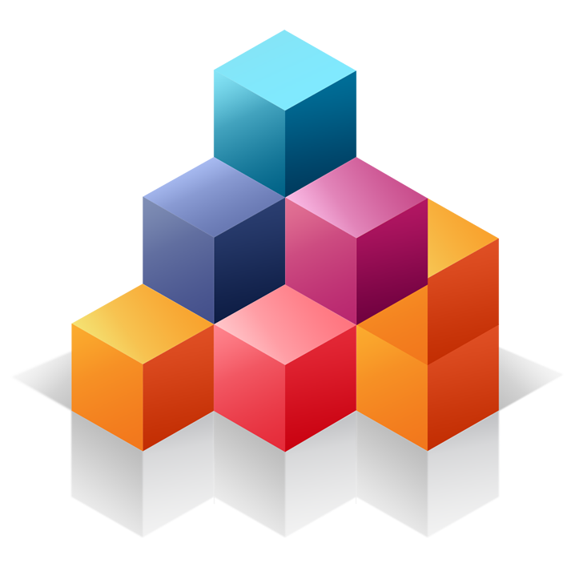
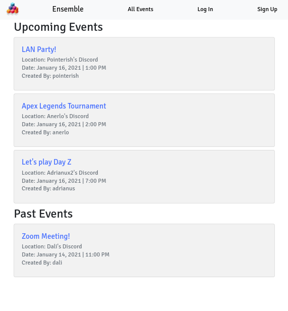
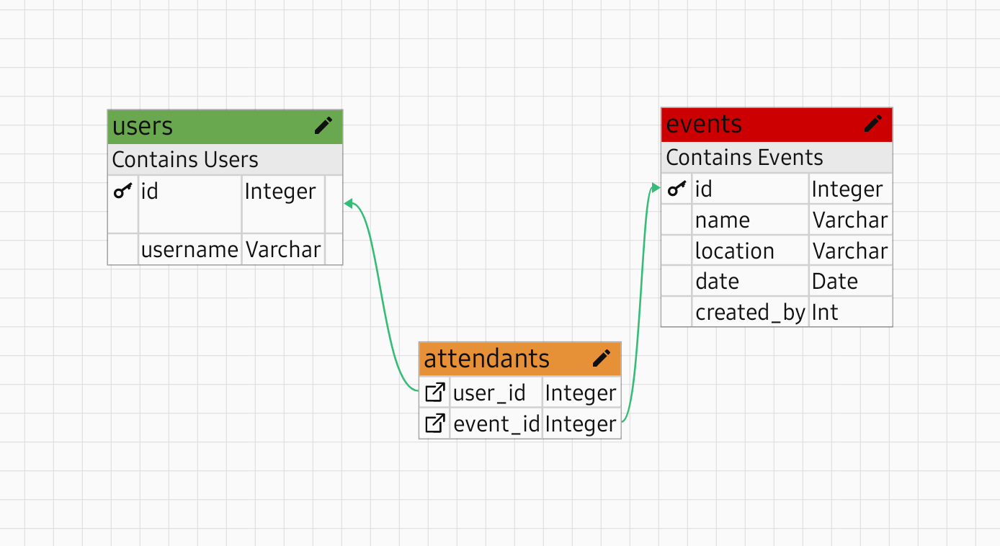

<h1 align="center">Ensemble</h1>

<b>Ensemble</b> is a Rails web application where users can host events and events can host users.

## Features

- Simple Signup, Login and Logout only requiring a username
- Logged in users can create new events, attend other user's events and see all available events
- An event can have many users and a user can create many events

## Database Structure

## Getting Started

In order to run `Ensemble` locally you need the following:

- Ruby 2.7.1 correctly installed
- Rails 6.1 correctly installed
- Clone the repository by either using HTTPS or SSH

To boot `Ensemble` run the following commands:

- `bin/bundle install` from inside of the project's root directory
- `bin/rails db:migrate` to run the database migrations
- `bin/rails db:seed` to setup test users and events
- `bin/rails s`  to run the application with the Puma web server

To run RSpect tests simply run the following command:

- `rspec`

## Author

👤 **Josias Alvarado**

- GitHub: [@pointerish](https://github.com/pointerish)
- Twitter: [@pointerish](https://twitter.com/pointerish)
- LinkedIn: [LinkedIn](https://www.linkedin.com/in/josias-alvarado/)

## Contributing

Contributions, issues, and feature requests are welcome!

Feel free to check the [issues page](https://github.com/pointerish/members-only/issues).

## Show your support

Give a ⭐️ if you like this project!

## Acknowledgments

- Odin Project
- Microverse
- Clipart
- My brain

## License

This project is [MIT](lic.url) licensed.